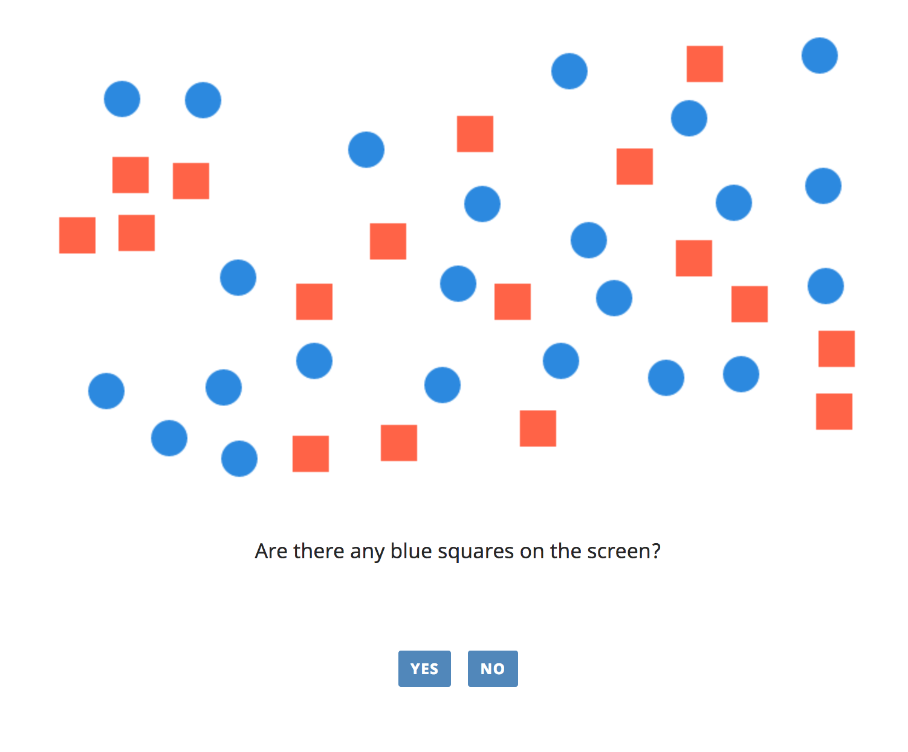
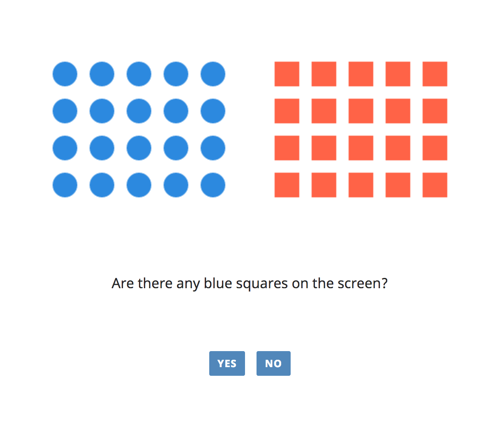

# \_babe project
basic architecture for browser-based experiments

**Latest version: 0.1.0**

- Major view restructuring (non-backwards compatible)
    - All template views are now instantiated by `babeViews.view_generator(<view_type>, <config>)`
        - You can pass a dict as an optional third parameter `{stimulus_container_generator: <custom_func>, answer_container_generator: <custom_func>, handle_response_function: <custom_func>}`
        - With this parameter, you can customize views
    - `trial_type` is no longer used and is replaced by `trial_name`


**Table of contents**

- [Create an experiment with \_babe](#create-an-experiment-with-_babe)
    - [Install and import \_babe](#install-and-import_babe)
    - [Experiment Initialisation](#experiment-initialisation)
    - [Views](#views-in-_babe)
    - [Deploy configuraton](#deploy-configuration)
    - [Progress bar](#progress-bar)
- [Sample experiment](#sample-experiment)
- [Development](#development)
- [Deployment using Netlify](#deployment-using-netlify)


## Create an experiment with \_babe

### Install and import \_babe

#### Option 1: Install with npm (recommended)

1. Get \_babe

You need to have npm installed in your machine. [Install npm](https://www.npmjs.com/get-npm).


```
# create a folder for your experiment

mkdir my-experiment

# move to the experiment's folder

cd my-experiment

# initialise npm (create a package.json file)

npm init

# install the dependencies with npm

npm install babe-project --save
```

the npm installation process creates a folder (named `node_modules`) in your experiment's directory where the npm dependencies are stored. After successfully installing \_babe, the `node_modules` folder should contain `babe-project` and its dependencies `jquery` and `csv-js`.

2. Add \_babe

The `babe-project` folder includes the following three files that you can add to your experiment:

- `babe.full.js` - includes \_babe functions and its dependencies (jquery nad csv-js), no need to install and import jquery and csv-js.
- `babe.js` - includes only \_babe functions (jquery nad csv-js), jquery and csv-js have to be included separately.
- `babe.css` - includes babe styles.

Import \_babe with a script tag:

add `babe.full.js`

`<script src='path/to/node_modules/babe-project/babe.full.js'></script>`

or add `babe.js`, `jquery` and `csv.js`

`<script src='path/to/node_modules/jquery/dist/jquery.min.js'></script>`

`<script src='path/to/node_modules/csv-js/csv.js'></script>`

`<script src='path/to/node_modules/babe-project/babe.js'></script>`

3. Update \_babe 

You can get newer versions of \_babe with

`npm update`


#### Option 2: Download the babe-project (not reccommended)

1. Download the .zip from this repository

2. Unzip and move `babe.full.js`, `babe.js` and `babe.css` in the `libraries/` folder of your experiment.

 Your experiment's structure should look like this:

- experiment/
    - libraries/
        - babe.full.js
        - babe.css
        - babe.js

 `babe.full.js` includes the dependencies that \_babe uses (jQuery, and csv-js). There is no need to install and import jQuery, and csv-js.

 `babe.js` includes only the \_babe package, the dependencies should be installed separately for \_babe to work.

 `babe.css` includes styles for \_babe experiments.

3. Import \_babe in your main `html` file

 the full version or no-dependencies version:

 `<script src="libraries/babe.full.js></script>` or `<script src="libraries/babe.js></script>`

 and \_babe-styles:

 `<link rel="stylesheet" type="text/css" href="libraries/babe.css">`


## Usage

Once you have installed and included \_babe in your files, you can start using \_babe funcitons to create your experiment.
You can use:

* babeInit({..}) - to initialize the experiment
* babeViews._view_({..}) - to create an instance of a \_babe view

### Experiment initialisation

Use `babeInit({..})` to create a \_babe experiment.

`babeInit` takes an object as a parameter with the following properties:

* `views_seq` - an array of view objects in the sequence you want them to appear in your experiment. [more info](https://github.com/babe-project/babe-base#views-in-_babe)
* `deploy` - an object with information about the deploy methods of your experiment. [more info](https://github.com/babe-project/babe-base#deploy-configuration)
* `progress_bar` - an object with information about the progress bars in the views of your experiment. [more info](https://github.com/babe-project/babe-base#progress-bar)


Sample `babeInit` call:

```
$("document").ready(function() {
    babeInit({
        views_seq: [
            intro,
            instructions,
            practice,
            main,
            thanks
        ],
        deploy: {
            "experimentID": "4",
            "serverAppURL": "https://babe-demo.herokuapp.com/api/submit_experiment/",
            "deployMethod": "debug",
            "contact_email": "YOUREMAIL@wherelifeisgreat.you",
            "prolificURL": "https://app.prolific.ac/submissions/complete?cc=ABCD1234"
        },
        progress_bar: {
            in: [
                "practice",
                "main"
            ],
            style: "default",
            width: 150
        }
    });
});
```

### Views in \_babe

\_babe views get inserted in a html element with id `main`, you need to have an html tag (preferrably `div` or `main`)
with `id="main"`

Sample `index.html`

```
<!DOCTYPE html>
<html>
    <head>
        ...
        ...
        ...
    </head>

    <body>
        <-- ask the participants to enable JavaScript in their browser -->
        <noscript>This task requires JavaScript. Please enable JavaScript in your browser and reload the page. For more information on how to do that, please refer to
            <a href='https://enable-javascript.com' target='_blank'>enable-javascript.com</a>
        </noscript>

        <!-- views are inserted in here -->
        <main id='main'>
            Loading...
        </main>

    </body>
</html>
```


#### Included views

\_babe provides several ready-made views which you can access form the `babeViews` object. The views use [js template strings](https://developer.mozilla.org/en-US/docs/Web/JavaScript/Reference/Template_literals)

* Trial Type Views (TTV):
    * `babeViews.forcedChoice` - binary forced-choice task
    * `babeViews.sliderRating` - slider rating task
    * `babeViews.textboxInput` - textbox input task
    * `babeViews.dropdownMenu` - dropdown menu task
    * `babeViews.ratingScale` - Likert-scale rating task
    * `babeViews.sentenceChoice` - text selection task
    * `babeViews.imageSelection` - click-on-a-picture task
    * `babeViews.keyPress`- press a button task
    * `babeViews.selfPacedReading`
    * `babeViews.selfPacedReading_ratingScale`

* Other Type Views (OTV):
    * `babeViews.intro`  - introduction view
    * `babeViews.instructions`-  instructions view
    * `babeViews.begin` - begin experiment view; can be used between the practice and the main view
    * `babeViews.postTest` - post-experiment questionnaire
    * `babeViews.thanks` - the last view that handles the submission of the results of creates a table with the results in 'Debug Mode'


Each \_babe view function takes an object as a parameter with obligatory and optional properties.
[Here](docs/views.md) you can find more information about how to use the \_babe views.

#### Custom views

You can also create your own views.

The views are functions that return an object with the following properties:

* `name: string` - the name of the view (the progress bar uses the name)
* `trials: number` - the number of trials this view appears
* `CT: 0` - current trial, always starts from 0
* `render: function` - a function that renders the view
    * pass `CT` and `babe` as parameters to render()

Add the data gathered from your custom trial type views to `babe.trial_data`

Sample custom trial type view:

*The templates use [js template strings](https://developer.mozilla.org/en-US/docs/Web/JavaScript/Reference/Template_literals)*

```
babeViews.pressTheButton = function(config) {
    const _pressTheButton = {
        name: config.name,
        title: config.title, // 
        buttonText: config.buttonText,
        render(CT, babe) {
            let startTime = Date.now();

            const viewTemplate =
            `<div class='view'>
                <h1 class="title">${title}</h1>
                <button id="the-button">${button}</button>
            </div>`;

            $("#main").html(viewTemplate);

            $('#the-button').on('click', function(e) {
                _babe.trial_data.push({
                    trial_type: config.trial_type,
                    trial_number: CT+1,
                    RT: Date.now() - startTime
                });
                _babe.findNextView();
            });
        },
        CT: 0,
        trials: config.trials
    };

    return _pressTheButton;
};

const mainTrial = babeViews.pressTheButton({
    name: 'buttonPress',
    title: 'How quickly can you press this button?',
    buttonText: 'Press me!',
    trial_type: 'main',
    trials: 1
});

$("document").ready(function() {
    babeInit({
        ...
        views_seq: [
            ...
            mainTrial,
            ...
        ],
        ...
    });
});
```

Sample custom info view:

```
babeViews.sayHello = function(config) {
    const _sayHello = {
        name: config.name,
        title: config.title,
        render(CT, babe) {
            const viewTemplate =
            `<div class='view'>
                <h1 class="title">${title}</h1>
                <button id="hello-button">Hello back!</button>
            </div>`;

            $("#main").html(viewTemplate);

            $('#hello-button').on('click', function(e) {
                _babe.findNextView();
            });
        },
        CT: 0,
        trials: config.trials
    };

    return _sayHello;
};

const hello = babeViews.sayHello({
    name: 'buttonPress',
    title: 'Hello!?',
    trials: 1
});

$("document").ready(function() {
    babeInit({
        ...
        views_seq: [
            ...
            hello,
            ...
        ],
        ...
    });
});
```

##### Canvas

babe also includes a small library to create simple shapes as a picture for your experiment.





Check the [canvas api](docs/canvas.md) for more information.

### Deploy configuration

The deploy config expects the following properties:

* `experimentID: string` - the experimentID is needed to recover data from the babe server app. You receive the experimentID when you create the experiment using the babe server app
* `serverAppURL: string` - if you use the _babe server app, specify its URL here
* `deployMethod: string` - use one of 'debug', 'localServer', 'MTurk', 'MTurkSandbox', 'Prolific', 'directLink'
* `contact_email: string` - who to contact in case of trouble
* `prolificURL: string` - the prolific completion URL if the deploy method is "Prolific"

prolificURL is only needed if the experiment runs on Prolific.


### Progress Bar

\_babe provides the option to include progress bars in the views specified in the `progress_bar.in` list passed to `babeInit`. Use the names of the views in `progress_bar.in`.

You can use one of the following 3 styles (include pictues)

* `separate` - have separate progress bars in each type of views declared in `progress_bar.in`
* `default` - have one progress bar throughout the whole experiment
* `chunks` - have a separate progress chunk for each type of view in `progress_bar.in`

Use `progress_bar.width` to set the width (in pixels) of the progress bar or chunk

Sample progress bar

```
$("document").ready(function() {
    babeInit({
        ...
        progress_bar: {
            in: [
                "practice",
                "main"
            ],                  // only the practice and the main view will have progress bars in this experiment
            style: "chunks",    // there will be two chunks - one for the practice and one for the main view
            width: 100          // each one of the two chunks will be 100 pixels long
        }
    });
});
```

[samples](docs/progress.md)

## Sample experiment

[Here](https://github.com/babe-project/departure-point) you can find a minimal experiment created with \_babe, you can use this template as a starting point for your experiment. [Showroom](https://github.com/babe-project/showroom) is an experiment which demonstrates most of \_babe's functionalities including most views, hooks and the canvas-api.

## Development

To get the development version of the \_babe package, clone this repository and install the dependencies by running `npm install` in the terminal.

### Workflow

branches:

- master - Current stable version.
- development - Development version. This is where new featues or bug fixes are pushed. When the version is stable, the branch is merged into master.

#### (1) Source files

- src/
    - `babe-canvas.js`
    - `babe-errors.js`
    - `babe-init.js`
    - `babe-progress-bar.js`
    - `babe-submit.js`
    - `babe-utils.js`
    - `babe-views.js`

- `babe.css`

#### (2) Create babe.js and babe.full.js

##### Option 1: Build the \_babe package files while developing

Use `npm run watch` command from the `babe-project` folder to start a process which watches for changes in the files in `src` and builds (updates) `babe.js` and `babe.full.js`. This commands builds both `babe.js` and `babe.full.js` when a file  in `src` is saved.

##### Option 2: Make changes to the files and then build the \_babe files

Run `npm run concat` from the `babe-project` folder. This command builds both `babe.js` and `babe.full.js`.

#### (3) Merge into master
- include a changelog information in the README
- merge to master
- [update the version of \_babe](https://docs.npmjs.com/about-semantic-versioning) in `package.json`

#### (4) Publish to npm

Run `npm publish` from the `babe-project` folder to publish the new version of \_babe.

## Deployment using Netlify 

1. Registration
    -  Go to https://www.netlify.com/ and sign up using GitHub
2. Deployment
    - Using git: Click on the `New site from Git`-Button, choose GitHub and authorize the netlify-app on GitHub, configure which repositories to give access to, (back on netlify) select the repository to deploy, enter the build command `rm -rf dist && mkdir dist && rsync -rv * dist --exclude ./dist` and the publish directory `dist` (this is a workaround for publishing `node_modules`, see [here](https://stackoverflow.com/questions/54527465/no-node-modules-from-netlify-deploy/54545546#54545546), another way of bundling the files may be appropriate), click on `Deploy site` 
    - Manual: Go to https://app.netlify.com/ and drag and drop your finished experiment folder (including node_modules) to the drag&drop area
3. Configuration
    - Change the domain name:
        - Click on the deployed site you want to configure, click on `Domain setting`, click on `Edit site name` and change to the name of choice.
