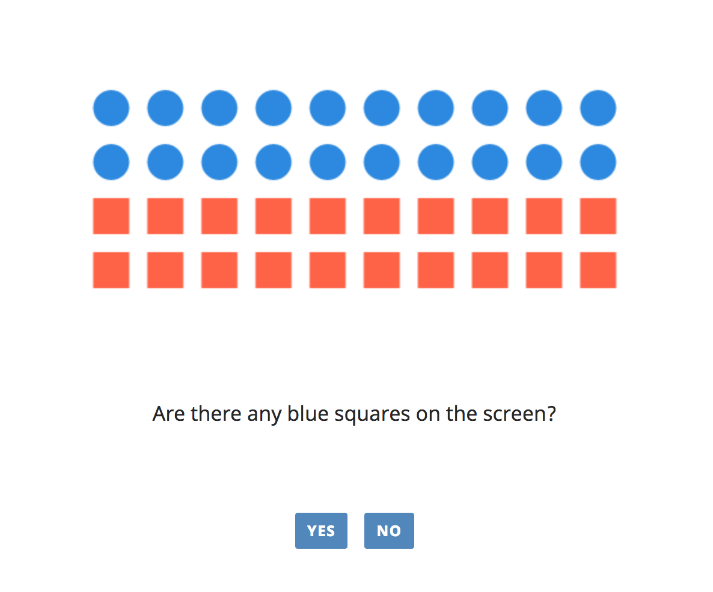

# \_babe canvas

Each babe trial type view can use the babe canvas api to create a picture of elements in the trial view.

babe provides three types of element plcement:

1. **random placement**


2. **grid placement**



3. **split grid placement**


## How to use babe canvas

To generate a picture of shapes, all you need is to have `canvas` object with some properties in the data your views use.

For example:

```
let trials = [
    ...,
    {
        question: "Are there any blue squares on the screen?",
        option1: 'yes',
        option2: 'no',
        canvas: {
            focalColor: 'black',
            focalShape: 'circle',
            focalNumber: 23,
            otherShape: 'square',
            otherColor: 'red',
            sort: 'random',
            elemSize: 30,
            total: 40
        }
    },
    ...
];
```

## Data format

### obligatory properties

- `sort` - the way the elements are arranged on the canvas.

    - `sort: 'random'` - randomly placed on the canvas. `start_with` does not have an effect with this arrangement method;

    - `sort: 'grid'` - the elements are placed in a grid. Uses `canvas.canvas.rows`;

    - `sort: 'split_grid'` - the elements are places in a grid that is split in the middle.

- `elemSize` - the size of the element's shapes (in pixels).

- `total` - the total elements that are drawn on the canvas.

- `focalColor` - the color of the focal elements.

- `focalNumber` - the number of focal elements wanted on the canvas.

- `focalShape` - the shape of the foca elements (can be 'triangle', 'circle' or 'square')

- `otherColor` - the color of the other elements

- `otherShape` - the shape of the elements (can be 'triangle', 'circle' or 'square')

The number of the other elements is total - focal.number


### optional properties

#### Grid placement and split Grid Placement extra properties

- `rows` the number of grid rows. Placed in one row of not given.

- `start_with` - the `grid` and `split_grid` coordinates are generated from left to right. By default first the focal elements are placed on the canvas so they always appear on the left unless `start_with` is set to `'other'`

    - `start_with: 'focal'`: places the focal shapes first (from left to right)

    - not set `start_with` places the focal shapes first (from left to right)

    - `start_with: 'other'`: places the other shapes first (from left to right)

#### Split Grid extra properties

- `gap` - the gap between the two sides

- `direction` - the direction in which the elements are placed. Set to `'row'` if not given.

    - `'row'` - in a row, starting from left to right, ignoring the gap between the two sides;

    - `'side_row'` - in a row starting from left to right, not ignoring the gap, i.e. first finishes with the left side and then moves to the right;

    - `'column'` - in a column, starting from top left.

### canvas element settings

You can add a `canvasSettings` object to your `canvas` if you want to set the height, width and background of the canvas.

for example:

```
canvas: {
    canvasSettings: {
        height: 600,
        width: 800,
        backrgound: 'grey'
    },
    focalColor: 'black',
    focalShape: 'circle',
    focalNumber: 23,
    otherShape: 'square',
    otherColor: 'red',
    sort: 'random',
    elemSize: 30,
    total: 40
}
```

If not passed the canvas's
- height is 300 (300px)
- width is 500 (500px)
- background is 'white'

## Samples
