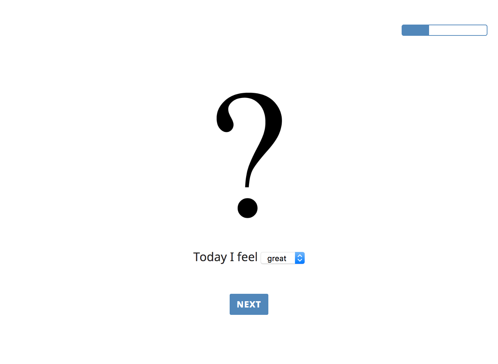
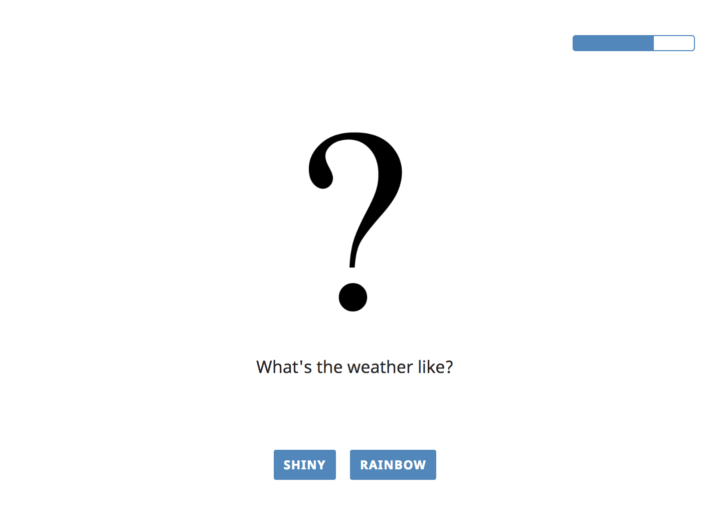
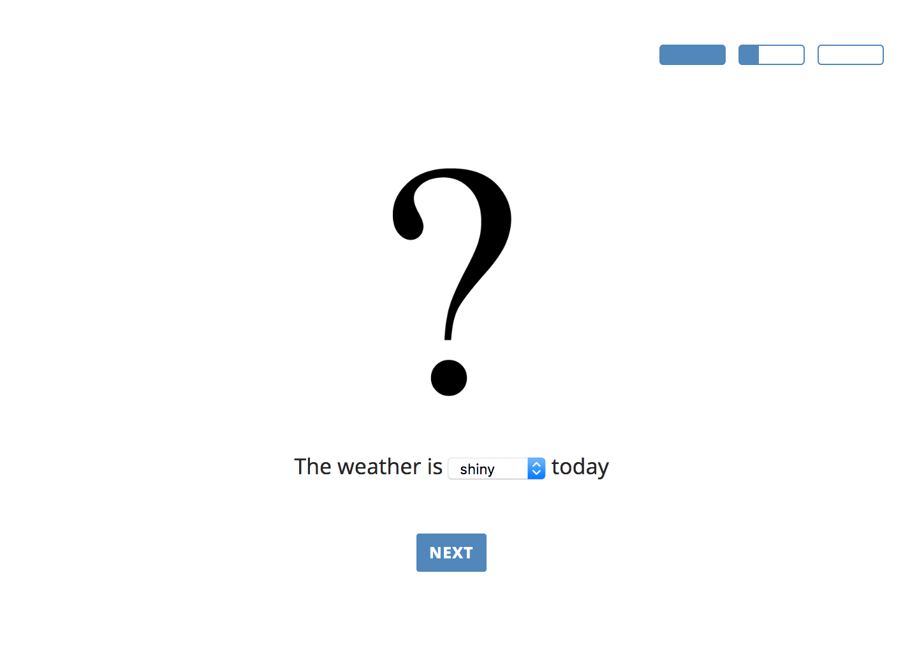

# \_babe progress bar



```
progress_bar: {
    in: [
        'forced_choice',    // 6 trials
        'dropdown_choice'   // 10 trials
        'slider_rating',    // 4 trials
    ],
    style: "default",
    width: 120          // 120 pixels
}


// 20 trials overall, each trial fills 10 pixels (120/20) part of the progress bar
```



```
progress_bar: {
    in: [
        'forced_choice',    // 6 trials
        'dropdown_choice'   // 10 trials
        'slider_rating',    // 4 trials
    ],
    style: "separate",
    width: 120          // 120 pixels
}


// 20 trials overall, each trial fills (120/total trials) pixels part of the progress bar. Each type of view has a separate progress bar.
```



```
progress_bar: {
    in: [
        'forced_choice',    // 6 trials
        'dropdown_choice'   // 10 trials
        'slider_rating',    // 4 trials
    ],
    style: "chunks",
    width: 60           // 60 pixels
}


// 20 trials overall, each trial fills part of its corresponding chunk. Each type of view has a separate progress bar and all progress bars are displyed.
```
