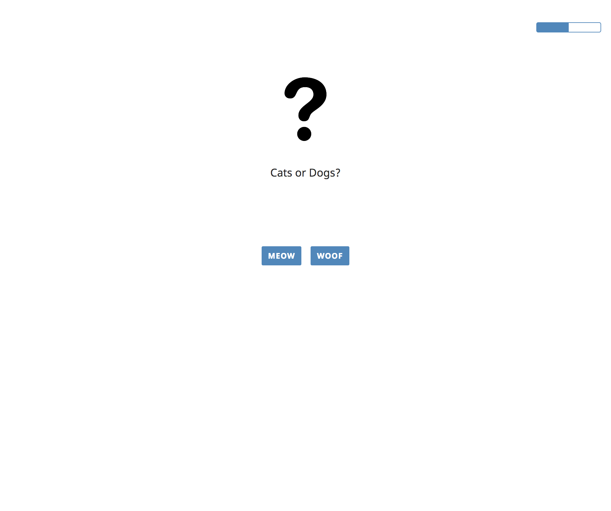
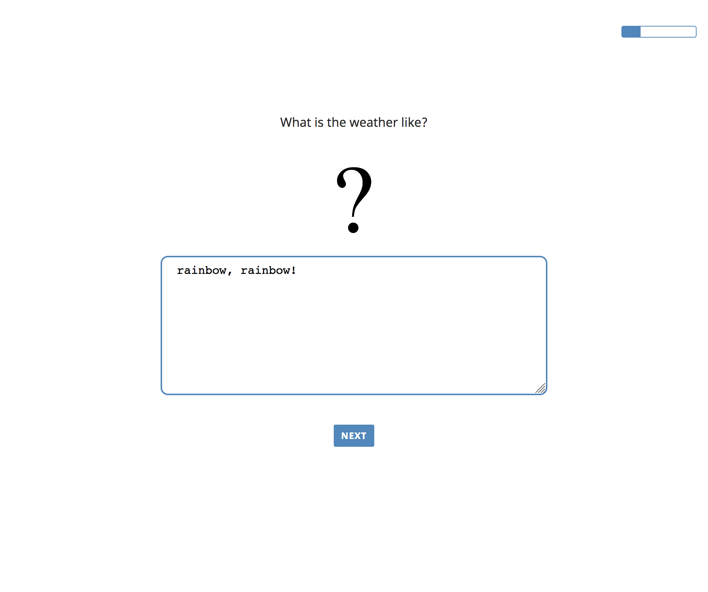
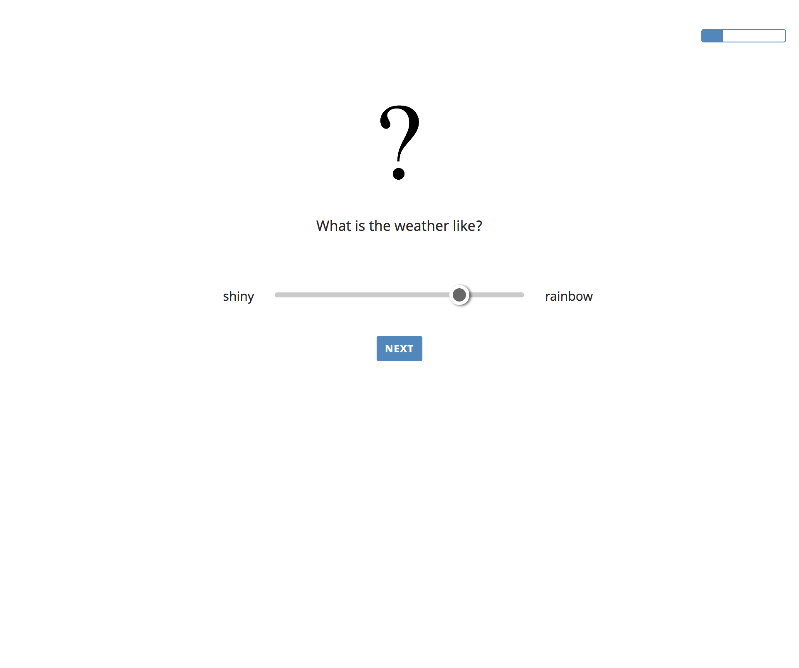
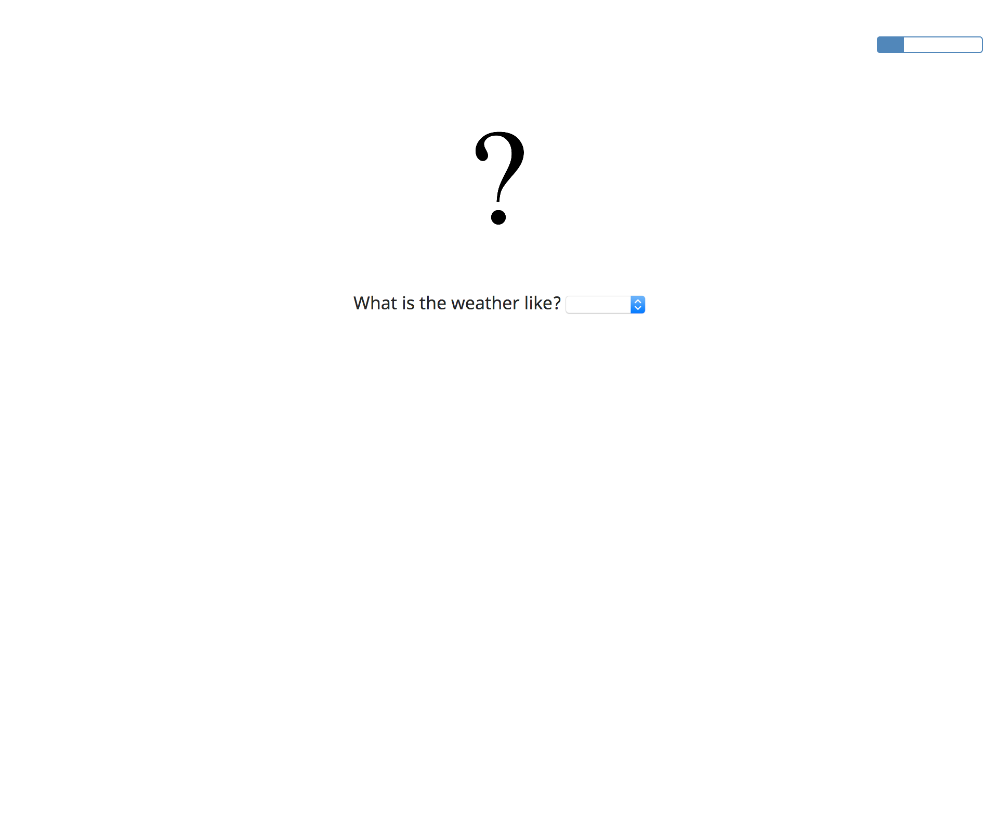
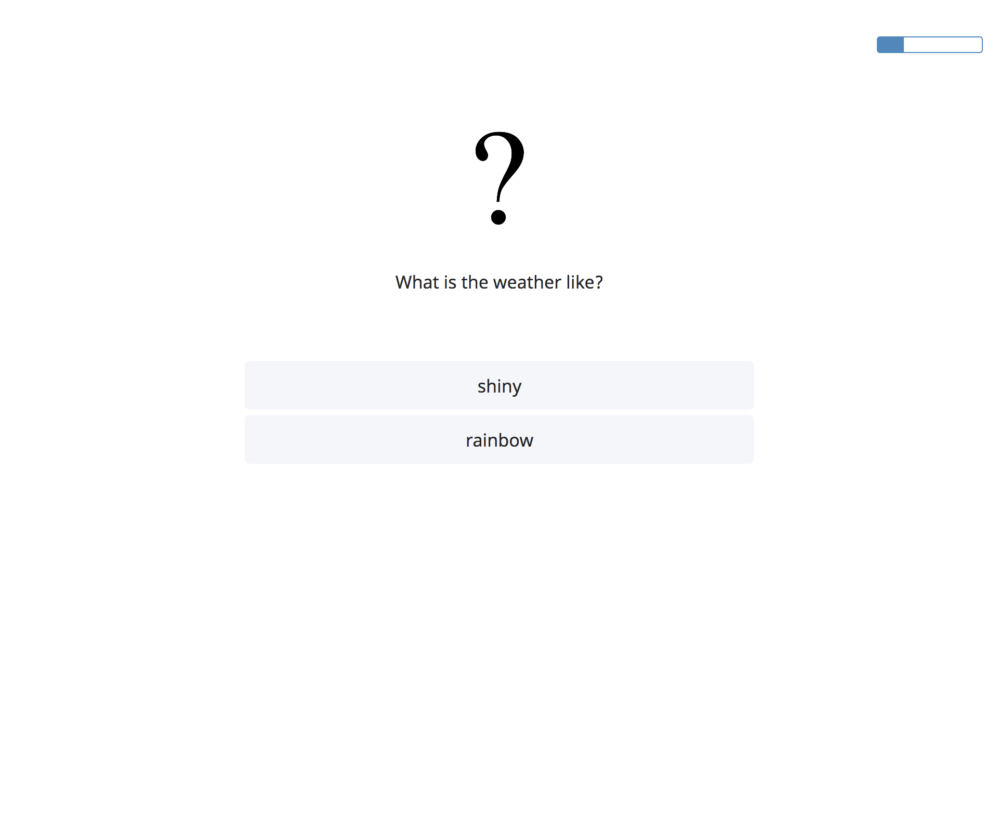
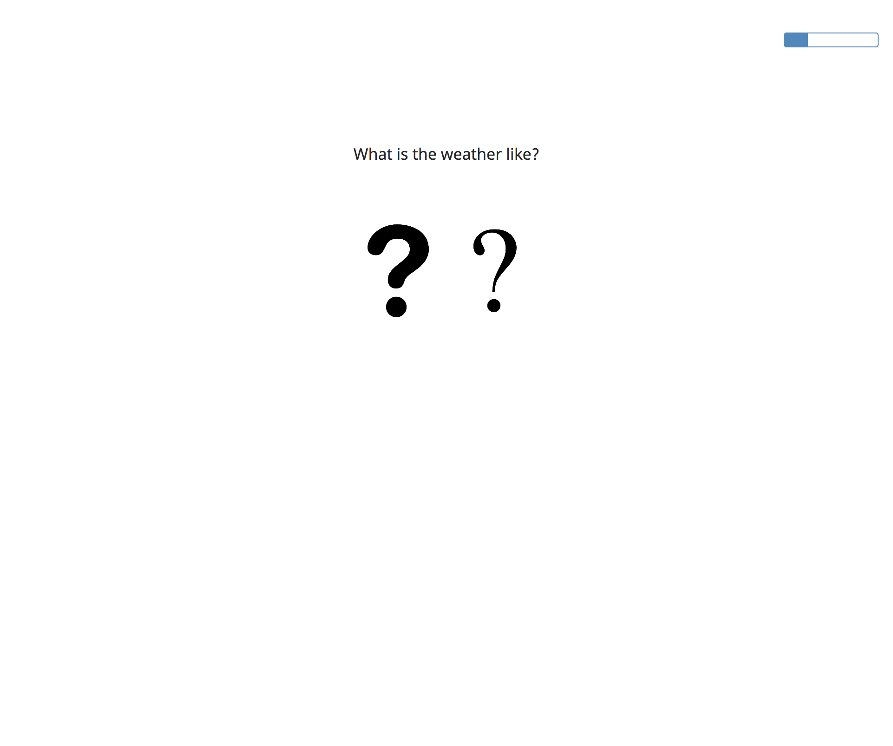
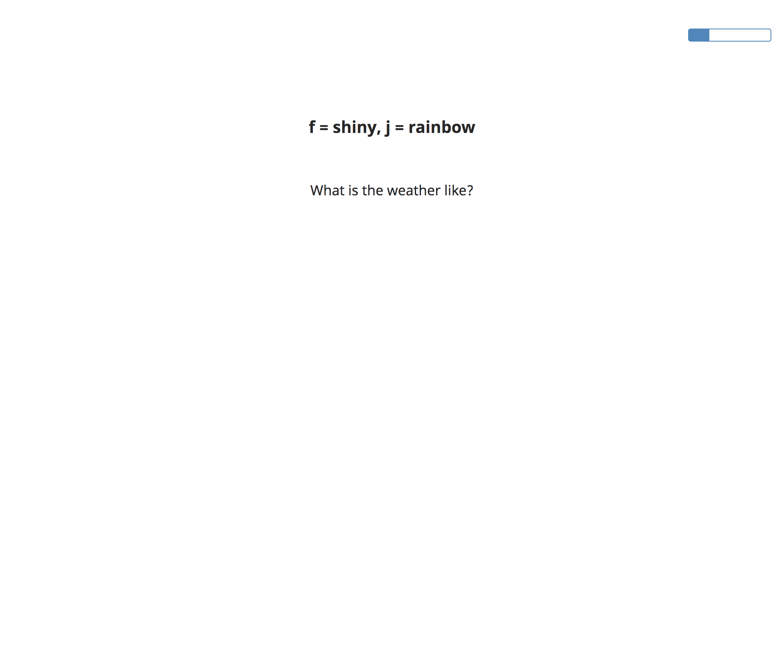

# \_babe views

## Forced-choice (binary choice) task



### Data properties

* `picture` (link) - *optional*
* `question` (string) - *optional*
* `option1` (string) -  **obligatory**
* `option2` (string) -  **obligatory**

### Sample data

```
const forced_choice_trials = [
    {
        picture: 'path/to/picture.jpg',
        option1: 'yes',
        option2: 'no'
    },
    {
        picture: 'path/to/picture_of_bread.jpg',
        question: 'What\'s on the bread?',
        option1: 'jam',
        option2: 'ham'
    },
    {
        question: 'What\'s the weather?',
        option1: 'shiny',
        option2: 'rainbow'
    }
];
```

## Textbox Input task



### Data properties

* `picture` (link) - *optional*
* `question` (string) - **obligatory**
* `min_length` (number) - **obligatory**

### Sample data

```
const textbox_input_trials = [
    {
        picture: 'path/to/picture.jpg',
        question: 'What\'s on the bread?',
        min_length: 100
    },
    {
        question: 'What\'s the weather?',
        min_length: 50
    }
];
```

## Slider Rating task



### Data properties

* `picture` (link) - *optional*
* `question` (string) - *optional*
* `option1` (string) -  **obligatory**
* `option2` (string) -  **obligatory**

### Sample data

```
const slider_rating_trials = [
    {
        picture: 'path/to/picture.jpg',
        option1: 'yes',
        option2: 'no'
    },
    {
        picture: 'path/to/picture_of_bread.jpg',
        question: 'What\'s on the bread?',
        option1: 'jam',
        option2: 'ham'
    },
    {
        question: 'What\'s the weather?',
        option1: 'shiny',
        option2: 'rainbow'
    }
];
```

## Dropdown Choice task

;

### Data properties

* `picture` (link) - *optional*
* `question` (string) - *optional*
* `option1` (string) -  **obligatory**
* `option2` (string) -  **obligatory**

### Sample data

```
const dropdown_choice_trials = [
    {
        picture: 'path/to/picture.jpg',
        option1: 'yes',
        option2: 'no'
    },
    {
        picture: 'path/to/picture_of_bread.jpg',
        question: 'What\'s on the bread?',
        option1: 'jam',
        option2: 'ham'
    },
    {
        question: 'What\'s the weather?',
        option1: 'shiny',
        option2: 'rainbow'
    }
];
```

## Rating Scale task

;

### Data properties

* `picture` (link) - *optional*
* `question` (string) - *optional*
* `option1` (string) -  **obligatory**
* `option2` (string) -  **obligatory**

### Sample data

```
const rating_scale_trials = [
    {
        picture: 'path/to/picture.jpg',
        option1: 'yes',
        option2: 'no'
    },
    {
        picture: 'path/to/picture_of_bread.jpg',
        question: 'What\'s on the bread?',
        option1: 'jam',
        option2: 'ham'
    },
    {
        question: 'What\'s the weather?',
        option1: 'shiny',
        option2: 'rainbow'
    }
];
```

## Sentence Selection task

;

### Data properties

* `picture` (link) - *optional*
* `question` (string) - *optional*
* `option1` (string) -  **obligatory**
* `option2` (string) -  **obligatory**

### Sample data

```
const sentence_selection_trials = [
    {
        picture: 'path/to/picture.jpg',
        option1: 'yes',
        option2: 'no'
    },
    {
        picture: 'path/to/picture_of_bread.jpg',
        question: 'What\'s on the bread?',
        option1: 'jam',
        option2: 'ham'
    },
    {
        question: 'What\'s the weather?',
        option1: 'shiny',
        option2: 'rainbow'
    }
];
```

## Image Selection task

;

### Data properties

* `question` (string) - *optional*
* `picture1` (link) - **obligatory**
* `picture2` (link) - **obligatory**
* `option1` (string) -  **obligatory**
* `option2` (string) -  **obligatory**

### Sample data

```
const image_selection_trials = [
    {
        picture1: 'path/to/picture1.jpg',
        picture2: 'path/to/picture2.jpg',
        option1: 'yes',
        option2: 'no'
    },
    {
        picture1: 'path/to/picture_of_bread1.jpg',
        picture2: 'path/to/picture_of_bread2.jpg',
        question: 'What\'s on the bread?',
        option1: 'jam',
        option2: 'ham'
    }
];
```

## Key Press task

;

### Data properties

* `picture` (link) - *optional*
* `question` (string) - *optional*
* `key1` (string) - **obligatory**
* `key2` (string) - **obligatory**
* `f` (string) -  **obligatory**
* `j` (string) -  **obligatory**
* `expected` (string) - **obligatory**

### Sample data

```
const key_press_trials = [
    {
        picture: 'path/to/picture.jpg',
        key1: 'f',
        key2: 'j',
        f: "fine",
        j: 'great',
        expected: 'great'
    },
    {
        question: 'What\'s the weather like?',
        key1: 'f',
        key2: 'j',
        f: 'shiny',
        j: 'rainbow',
        expected: 'shiny'
    },
    {
        question: 'What\'s on the bread?',
        picture: 'path/to/picture.jpg',
        key1: 'f',
        key2: 'j',
        f: 'ham',
        j: 'jam',
        expected: 'jam'
    }
];
```
